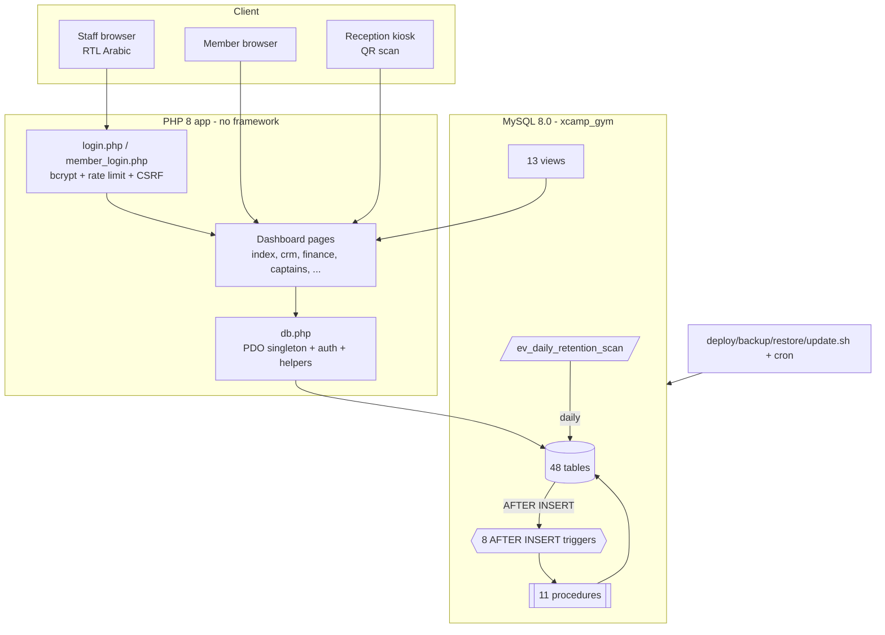

# Architecture

> Tags: `[VERIFIED]` · `[INFERRED]` · `[UNKNOWN]` · `[CONFLICTING]`

## 1. Style
A **classic server-rendered PHP application** — no framework, no ORM, no build step. Each dashboard page is a self-contained PHP script that `require`s a shared `db.php` (connection + auth + helpers), queries MySQL via **PDO prepared statements**, and echoes RTL Arabic HTML. `[VERIFIED — dashboard/*.php all begin `require __DIR__ . '/db.php'`]`

Substantial business logic lives **inside the database** (11 stored procedures, 8 triggers, 1 scheduled event, 13 views), so the DB is not a passive store — it is an active tier. `[VERIFIED — sql/02–05]`

## 2. Layers
| Layer | Implementation | Evidence |
|---|---|---|
| Presentation | Inline HTML in each `.php`, shared chrome via `page_head()`/`page_foot()` in db.php | `[VERIFIED]` db.php |
| Application / controller | One PHP script per page; role guard at top (`require_role`/`require_login`/`require_member`) | `[VERIFIED]` |
| Data access | `db(): PDO` singleton, prepared statements, `ENV`-configured DSN | `[VERIFIED]` db.php:~40–60 |
| Domain automation | MySQL triggers → stored procedures; scheduled event | `[VERIFIED]` sql/02,03,04 |
| Reporting | SQL views (`vw_*`) consumed by dashboard/analytics pages | `[VERIFIED]` sql/05 |
| Ops | Bash scripts: deploy/reset/update/backup/restore + cron | `[VERIFIED]` *.sh |

## 3. Runtime topology `[INFERRED from headers + scripts]`
- PHP built-in server for dev: `php -S 0.0.0.0:8000` (documented in index.php header and `update.sh`). Production server not specified `[UNKNOWN]`.
- MySQL 8.0 reached over TCP `127.0.0.1:3306` by default (scripts) `[VERIFIED — deploy.sh/backup.sh defaults]`.
- Config via environment variables (`DB_HOST/PORT/USER/PASS/NAME`) `[VERIFIED]`.

`[VERIFIED — structure; diagram is a faithful synthesis of read files]`

## 4. Key cross-cutting mechanisms
- **Auth & session**: session-based, `session_regenerate_id(true)` on login, hardened cookie params. `[VERIFIED]` login.php, db.php
- **CSRF**: token minted in session, verified with `hash_equals()` via `csrf_check()`. `[VERIFIED]` db.php
- **Output encoding**: `h()` = `htmlspecialchars(..., ENT_QUOTES)`. `[VERIFIED]` db.php
- **RBAC**: enforced twice — page-level guards + nav visibility in `page_head()`. `[VERIFIED]` db.php, page headers
- **Coach scoping**: pages compute `$myCoach`/`$isCoach` and filter queries by `coach_id`. `[VERIFIED]` crm.php, retention.php, revenue.php, captains.php
- **Re-runnable schema**: every object is `DROP … IF EXISTS` then `CREATE`; loader is `run_all.sql` / `deploy.sh`. `[VERIFIED]`
- **Seeding guard**: triggers no-op while `@seeding=1` so the fixed-ID seed is not duplicated. `[VERIFIED]` 03_triggers.sql header, run_all.sql

## 5. Notable design decisions
- **Logic-in-DB**: retention/onboarding rules are in procedures, not PHP — a single source of truth invoked regardless of which page inserts the row. `[VERIFIED]`
- **Two auth realms**: staff (`users`) and members (`member_auth`) are separate tables and separate login flows. `[VERIFIED]`
- **Zero external runtime deps in two hotspots**: QR generation (`qr.php`) and training math (`training.php`) are pure PHP by deliberate choice (header comments). `[VERIFIED]`
